# Sip & Rate Server/API
Sip & Rate allows beer and wine lovers to search and rate some of their favorite or least favorite beverages. Can't remember how you felt about a certain drink? Problem solved! <br>
<a href="https://github.com/bahitssara/sip-and-rate-api/" target="_blank">Sip & Rate API Repo</a><br>
<a href="https://github.com/bahitssara/Sip-and-Rate" target="_blank">Sip & Rate Client Repo</a><br>
<a href="https://sip-and-rate.saraamayberry.now.sh/" target="_blank">Live App</a> 

## Motivation
I was inspired to create an app that allows wine and beer lovers to search their favorite or least favorite drinks, and store their thoughts about them all in one place. As a wine lover myself I've found it's easy to have a wine and not remember at all how I felt about it. Then was born Sip & Rate!

## <u>User-stories, UX Wireframes, Screenshots</u>
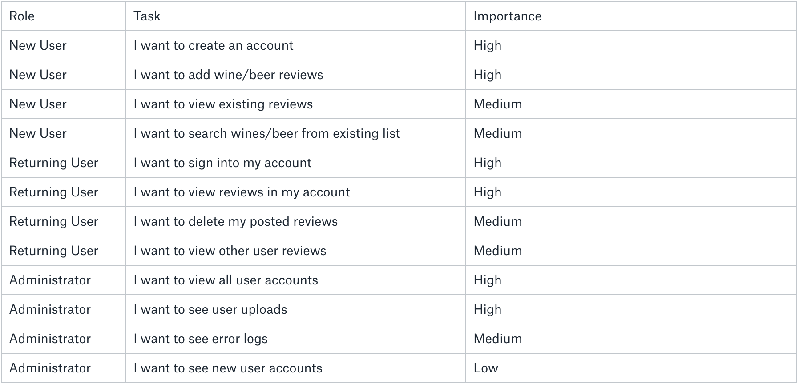

#### As a user I want to create an account
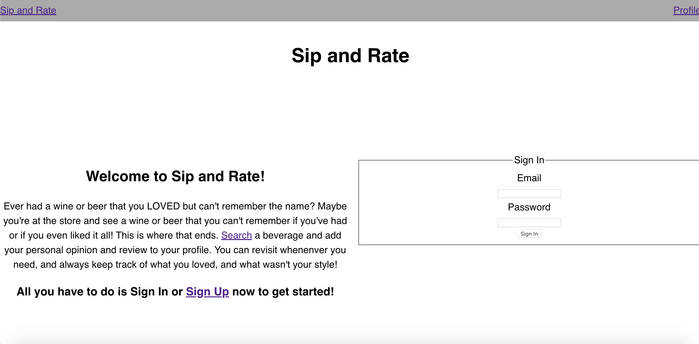
#### I want to search wines/beer from existing list
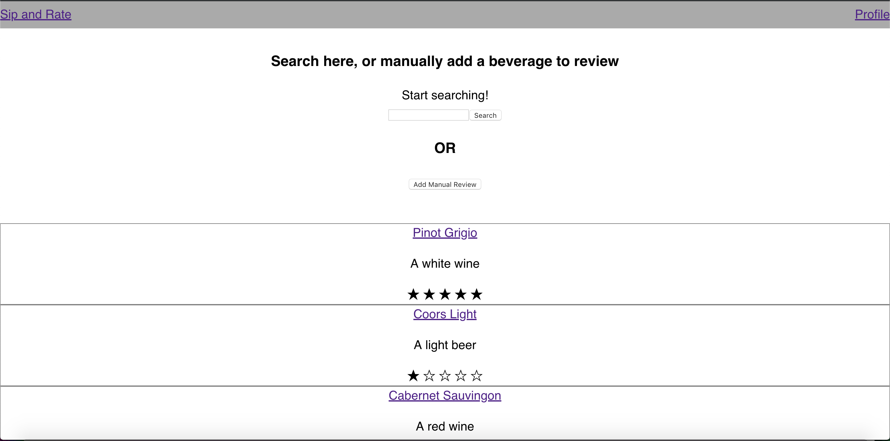
#### As a user I want to add wine/beer reviews
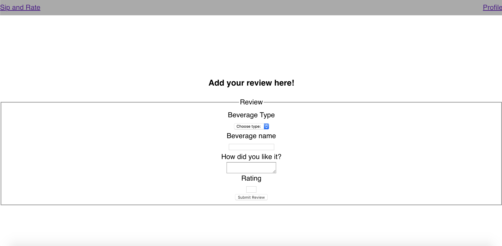
#### As a user I want to view existing reviews
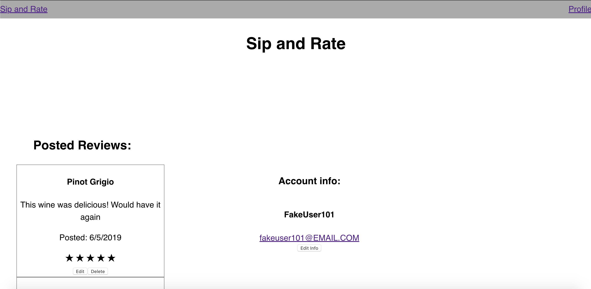

## <center><u>MVP</u></center>
### <center>Mobile view</center>
#### Home page
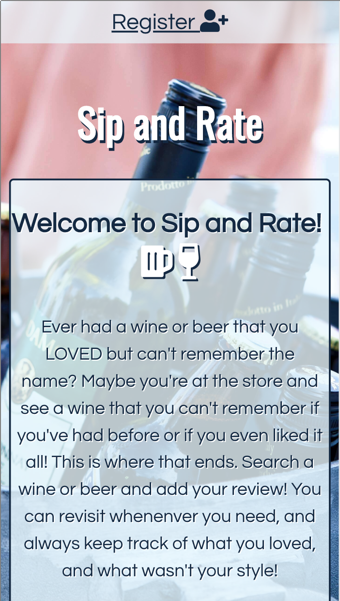
#### Registration page
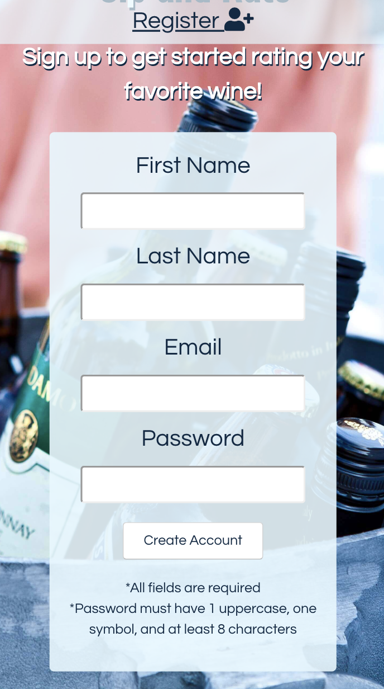
#### All reviews
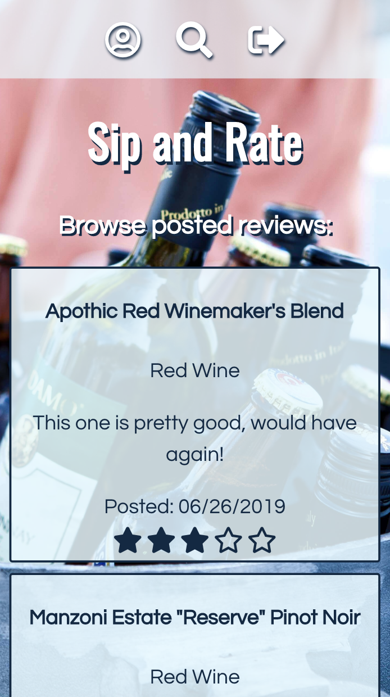
#### Search beverages
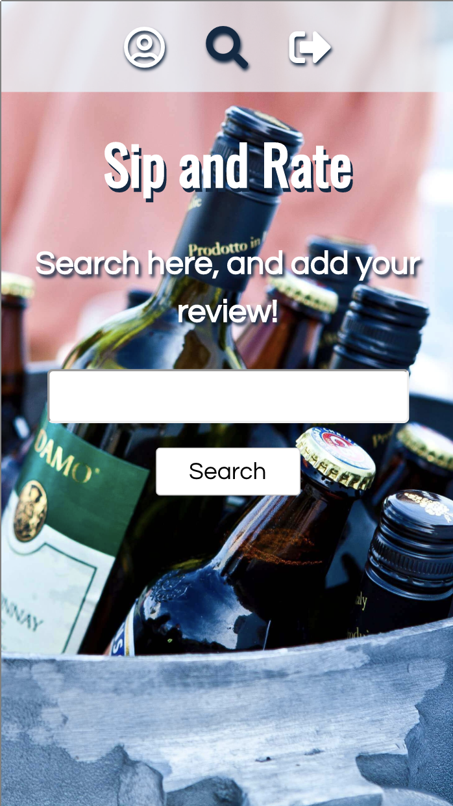
#### Search results/Add review
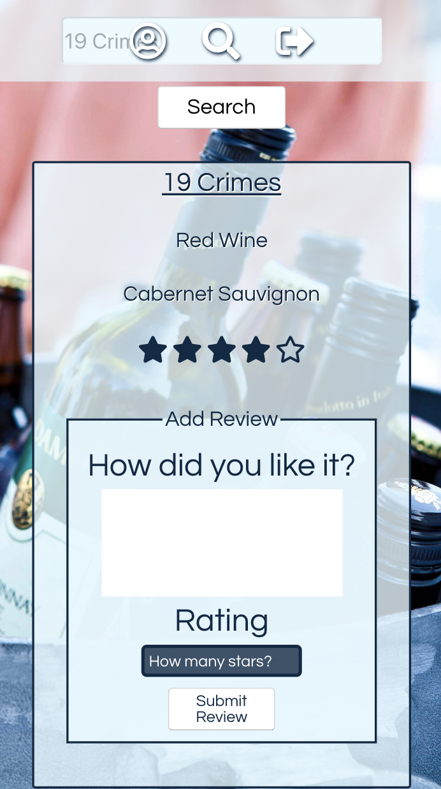
#### Profile/Your reviews
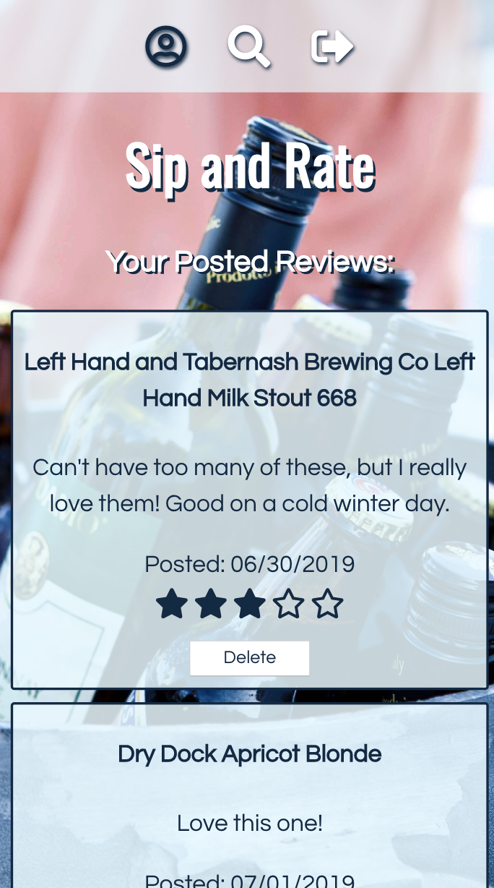

## <Center>Desktop view</center>
#### Home page
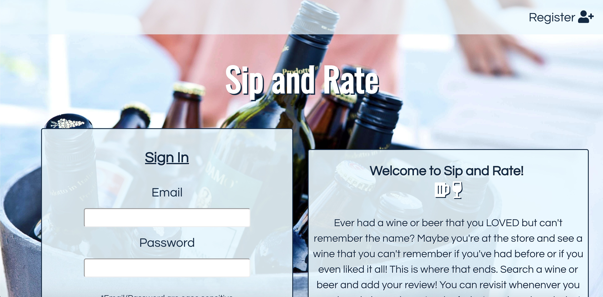
#### Registration page
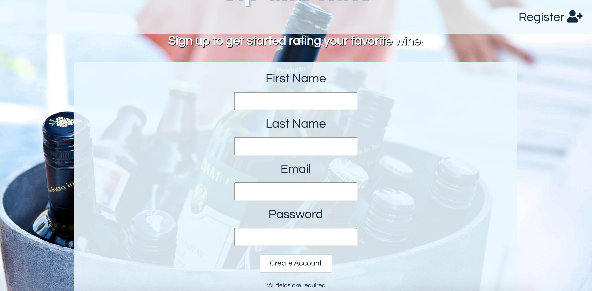
#### All reviews
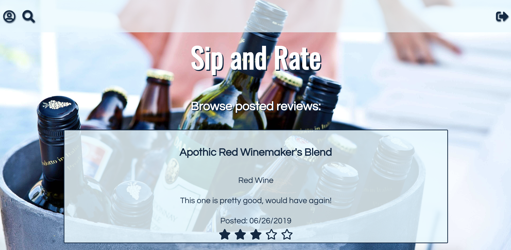
#### Search beverages

#### Search results/Add review
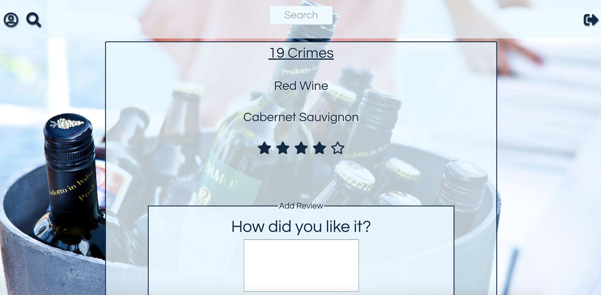
#### Profile/Your reviews
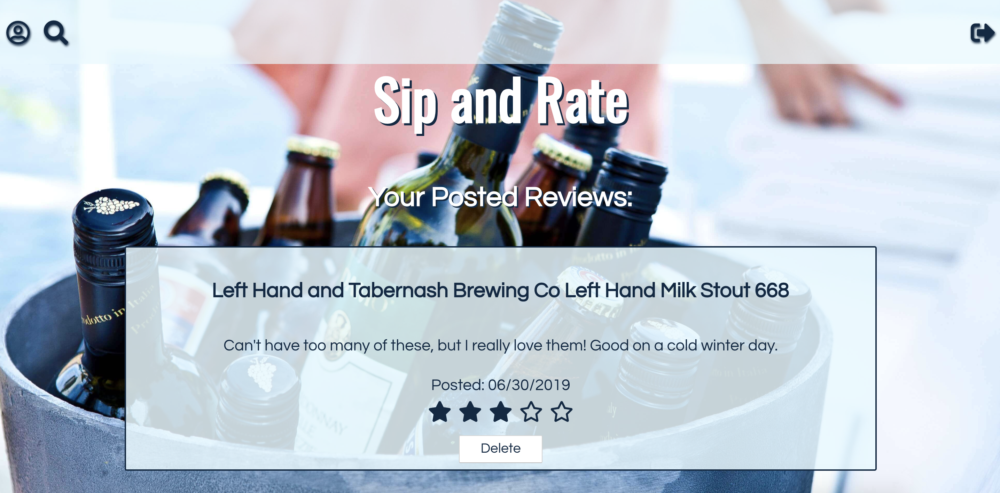

## Summary
Sip & Rate is an app that allows users to create a simple account, and once logged in can search a wine they've had, and give their thoughts! This app is focused for personal use and aimed at frequent users who return to view all their thoughts! Users can also view all posted reviews, just to see what others may think. This app is the perfect place to keep tabs on all your favorite and least favorite grape beverages!

## Built with
  ### Front end
    -HTML
    -Javascript
    -React
    -CSS

  ### Back end
    -Node.js
    -Express.js
    -PostgreSQL
    -Mocha and Chai for testing
    -Snooth API 

## Development road map
  * Allow users to organize their personal reviews into folders.
  * Search existing reviews
  * Compile reviews posted to retrieve a site specific overall review value
  * Update select input to use clickable interactive stars as the rating input

## Available Scripts

### Node Js
  ```npm install``` - Installs node modules<br>
  ```npm run dev```- Starts development/node server<br>
  ```npm test``` - Runs tests

### React
  ```npm install``` - Installs node modules<br>
  ```npm test``` - Runs tests
  ```npm start``` - Runs React App in development mode<br>
  Open [http://localhost:3000](http://localhost:3000) to view it in the browser.<br>


The page will reload if you make edits.<br>
You will also see any lint errors in the console.

